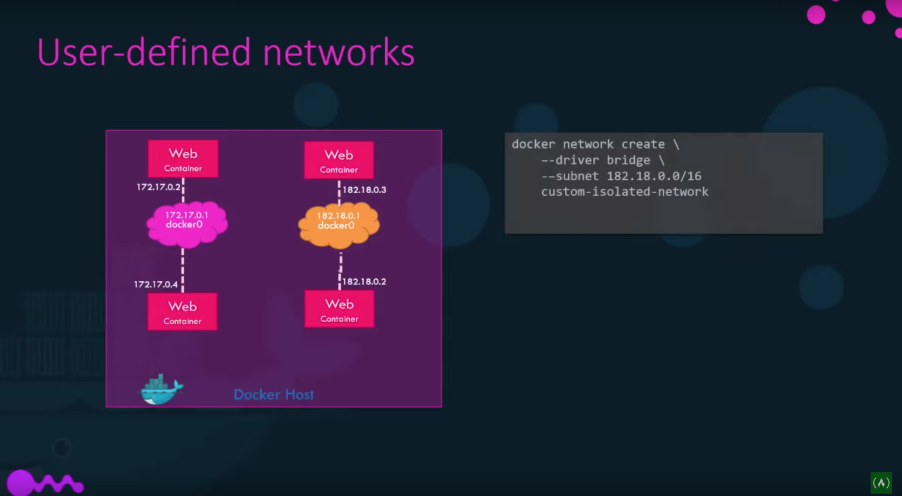
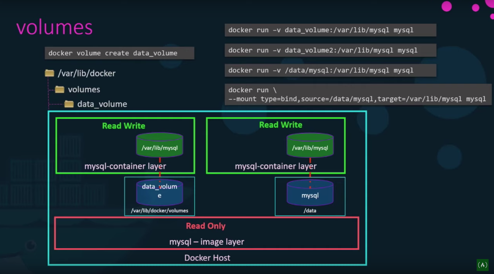

DOCKER NOTES
=========

- Reference: https://www.youtube.com/watch?v=fqMOX6JJhGo

Containers
====
- Containers are alive as long as the process is running. If the process stops/crash, the container exists

Download and Run container in attached mode
    
    $ docker run kodekloud/simple-webapp

Running contianer in deattached mode (or in the background)
    
    $ docker run -d kodekloud/simple-webapp

To attach to the container previously running in deattached mode  
First few container ids should be sufficient.
    
    $ docker attach a0345d 

Executing command inside a container

    $ docker exec container_name cat /etc/hosts

If no tag is specified, docker pull and run latest  
To, specify image and version(tag)
    
    $ docker run redis:4.0

- In this example, we have a simple shell script that has been dockerlized.

Below does not prompt for user input but prints the message
    
    $ docker run kodekloud/simple-prompt-docker

Below is interactive which waits for user input but does not show the prompt questions because we are not attached to container shell
    
    $ docker run -i kodekloud/simple-prompt-docker

Below is interactive and we are attached to the container shell
    
    $ docker run -it kodekloud/simple-prompt-docker

Port Mapping:
=====

Below example shows a sample webapp starting on port 5000 inside the container
    
    $ docker run kodekloud/webapp
    * Running on http://0.0.0.0:5000/

Each container has an ip address attached to it which is accessible only from inside the docker-host
    
    eg: container-ip: 172.17.0.2 is accessible from inside host-ip: 192.16.1.5

To make container accessible from outside the docker-host, we have to port map  
Below example maps 3 webapps to 3 different docker-host ports

    $ docker run -p 80:5000 kodekloud/simple-webapp
    $ docker run -p 8000:5000 kodekloud/simpole-webapp
    $ docker run -p 8001:5000 kodekloud/simpole-webapp

Volume Mapping:
====

Mount host directory to directory inside the container
    
    $ docker run -v /dir/in/docker/host:/var/lib/mysql mysql

Get information about a specific container
    
    $ docker inspect container_name

Environment Variables:
====

Environment variables can be passed from docker command line into the application.

    $ docker run -e APP_COLOR=blue simple-webapp-color
    $ docker run -e APP_COLOR=green simple-webapp-color

To find all the environment variables set on a container

    $ docker inspect container_name

Docker Image
====

Create docker image using Dockerfile

    file: Dockerfile
    FROM Ubuntu
    
    RUN apt-get update
    RUN apt-get install python

    RUN pip install flask
    RUN pip install flask-mysql

    COPY . /opt/source-code

    ENTRYPOINT FLASK_APP=/opt/source-code/app.py flask run

Build the image 

    $ docker build Dockerfile -t nfmohammed/my-custom-app
    $ docker push nfmohammed/my-custom-app

CMD vs EntryPoint
====

Command line parameters overrides `CMD` instruction

Command line parameters are `appended` to Entrypoint instruction

If we run the following container, docker will start it but exists immediately because the default `CMD` in ubuntu is `bash`. To override default `CMD` we can pass override command `sleep 5` when starting the container.  

    $ docker run ubuntu
    * container exists immediately

    $ docker run ubuntu sleep 5
    * container lives for 5 seconds

Changing default command after the container is started
We can use command format or json format to specific `CMD`

    file:Dockerfile
    FROM UBUNTU
    ...
    ...
    CMD Sleep 5
    CMD ["Sleep", "5"]

In case of Entrypoint, command line parameters are appended to the instruction.  
This allows us to pass the number of sleep seconds to the contaiiner

    $ docker run ubuntu-sleeper 10
    * sleeps for 10 seconds

    file:Dockerfile
    FROM UBUNTU
    ..
    ..
    ENTRYPOINT["sleep"]

CMD and Entrypoint can be used together to define default sleep time

    $ docker run ubuntu-sleeper
    * sleeps for default 5 seconds

    $ docker run ubuntu-sleeper 10
    * sleeps for 10 seconds

    file: Dockerfile
    FROM UBUNTU
    ..
    ..
    ENTRYPOINT["sleep"]
    CMD["5"]

Modifying entrypoint during docker command

    $ docker run --entrypoint sleep2.0 ubuntu-sleeper 10

Docker Networking
====

To inspect network info

    $ docker inspect container_name
    $ docker network ls

When docker is installed, it creates 3 network
    
    - Bridge (default):  $docker run ubuntu 
    - None:  $docker run ubuntu --network=none
    - Host: $docker run ubuntu --network=host

- Bridge Network:
    - All containers receive ip address in range `172.17.0.x` and are accessible to one another.
    - Containers can be accessed outside the host thru port mapping

- None network:
    - Container is not accessible outside the host

- Host network:
    - The port on container is the same port as that of the host. 
    - If a webapp is started at port 5000 then another webapp will have to chose a different port on the host

To create networks within the docker-host

    file:Dockerfile
    
    docker network create \
        --driver bridge \
        --subnet 182.18.0.0.16
        custom-isolated-network

FileSystem and Storage
====

Docker filesytem inside the docker-host

- /var/lib/docker
    - aufs
    - containers
    - image
    - volumes

To create new volume inside `volumes` foler

    $ docker volume create data_volume

To mount host volume(directory) to containers directory  
Mysql default data storage location is /var/lib/mysql

    $ docker run -v data_volume:/var/lib/mysql mysql

    $ docker run -v data_volume2:/var/lib/mysql mysql
    (date_volume2 is created inside volumes foler)

    $ docker run -v /data/mysql:/var/lib/mysql mysql
    (bind host directory to container directory. Notice the absolute path)

New method of mounting volumes instead of `-v`

    $ docker run \
    --mount type=bind,source=/data/mysql,target=/var/lib/mysql mysql

## Storage Drivers:

- Storage drivers are responsible for creating layered architecture as seen in above image.

- They make files Read/Write inside containers

- They bind/sync the filesystems between host and containers.

- Common storage drivers:
    - AUFS
    - ZFS
    - BTRFS
    - Device Mapper
    - Overlay
    - Overlay2

