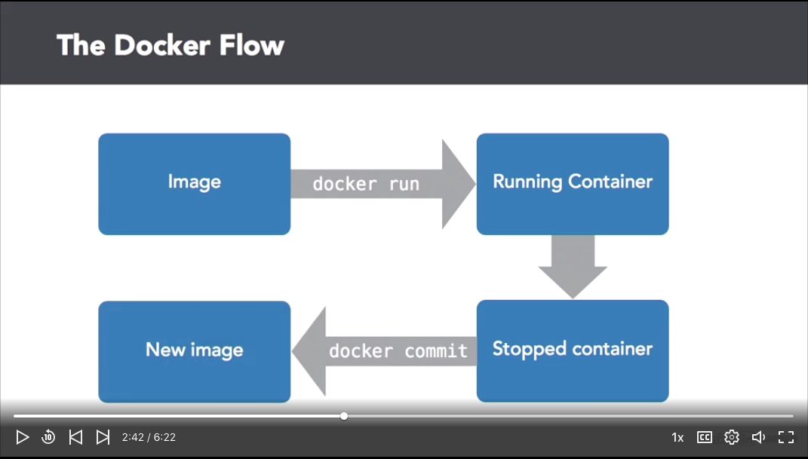
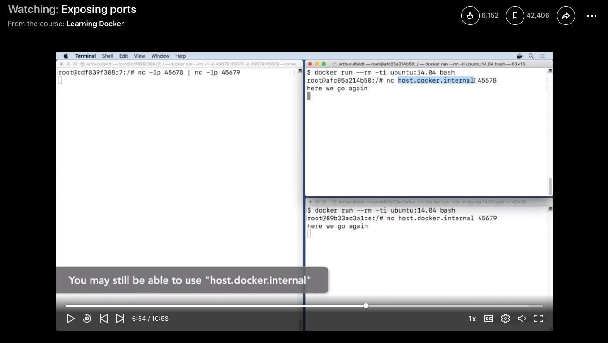
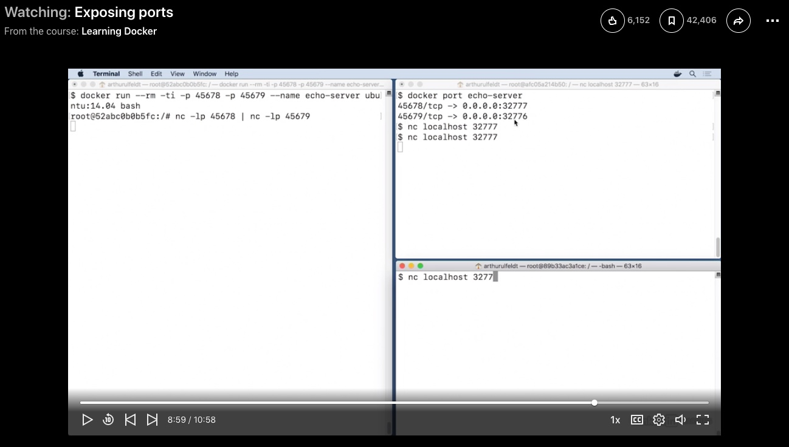

Table of Contents
====
- [Docker Flow](#docker-flow)
- [Images](#images)
- [Docker Image from Dockerfile](#docker-image-from-dockerfile)
- [Containers](#containers)
- [Exposing Ports](#exposing-ports)
- [Dynamic Ports](#dynamic-ports)
- [Port Mapping](#port-mapping)
- [Volume Mapping](#volume-mapping)
- [Environment Variables](#environment-variables)
- [CMD vs EntryPoint](#cmd-vs-entrypoint)
- [Docker Networking](docker-networking.md)
- [FileSystem and Storage](#filesystem-and-storage)
- [Storage Drivers](#storage-drivers)
- [Docker Compose](#docker-compose)
- [Docker Registry](#docker-registry)
- [Docker Engine](#docker-engine)
- [Docker on Windows](#docker-on-windows)
- [Docker on Mac](#docker-on-mac)
- [Container Orchestration](#docker-orchestration)
- [Docker Cheatsheet](#docker-cheatsheet)
- [References](#references)

Docker Flow
====

    $ docker run imageName (starts a container)
    $ docker commit containerName (creates Image from container)

Images
====

    $ docker images
    (lists docker images)

    $ docker commit containerId newImageName
    (creating image from container)

    $  docker rmi image-name:tag
    or
    $ docker rmi imageId

Docker Image from Dockerfile
====

Create docker image using Dockerfile

    file: Dockerfile
    FROM Ubuntu
    
    RUN apt-get update
    RUN apt-get install python

    RUN pip install flask
    RUN pip install flask-mysql

    COPY . /opt/source-code

    ENTRYPOINT FLASK_APP=/opt/source-code/app.py flask run

Build the image 

    $ docker build Dockerfile -t nfmohammed/my-custom-app
    $ docker push nfmohammed/my-custom-app

Containers
====
- Containers are alive as long as the process is running. If the process stops/crash, the container exists

Download the image and starts the container using the image, in attached mode
    
    $ docker run kodekloud/simple-webapp

Running contianer in deattached mode (leave container running in the background)
    
    $ docker run -d kodekloud/simple-webapp

To attach to the container previously running in deattached mode  
First few container ids should be sufficient.
    
    $ docker attach a0345d 
    or 
    $ docker attach containerName

Executing command inside a container

    $ docker exec container_name cat /etc/hosts

If no tag is specified, docker pull and run latest  
To, specify image and version(tag)
    
    $ docker run redis:4.0

- In this example, we have a simple shell script that has been dockerlized.

Below does not prompt for user input but prints the message
    
    $ docker run kodekloud/simple-prompt-docker

Below is interactive which waits for user input but does not show the prompt questions because we are not attached to container shell
    
    $ docker run -i kodekloud/simple-prompt-docker

Below is interactive and we are attached to the container shell
    
    $ docker run -it kodekloud/simple-prompt-docker

Exposing Ports:
====

- Start a container with port mapping. The port 45678 will be used for incoming data and 45679 will be used for output. Lets call it our `Test Container`

    $ docker run --rm -ti -p 45678:45678 -p 45679:45679 --name echo-server ubuntu:14.04 bash

    //execute below command, inside the container. Using netcat to listen to data on port 45678 and piping the same data out to port 45679
    
    $$$ nc -lp 45678 | nc -lp 45679
    
- Then we will create 2 more containers, one for sending data to `Test Container` and other to receive data from `Test Container`

    //start 2nd container for transmitting data
    $ docker run --rm -ti ubuntu:14.04 bash

    (connect to host port 45678) 
    $$$ nc host.docker.internal 45678

    $$$ hello message from 2nd container

    //start 3rd container to receive data
    $ docker run --rum -ti ubuntu:14.04 bash

    (connect to host port 45679)
    $$$ nc host.docker.internal 45679
    $$$ hello message from 2nd container

Dynamic Ports
====

- Instead of specifying both inside/outside port number for container, we can chose to specify only the inside port. We will then be able to find the outside port using port command.

- In this example, docker dynamically chose host ports 32777/32776 to map to 45678/45679 respectively.

    $ docker port containerName

Port Mapping:
=====

Below example shows a sample webapp starting on port 5000 inside the container
    
    $ docker run kodekloud/webapp
    * Running on http://0.0.0.0:5000/

Each container has an ip address attached to it which is accessible only from inside the docker-host
    
    eg: container-ip: 172.17.0.2 is accessible from inside host-ip: 192.16.1.5

To make container accessible from outside the docker-host, we have to port map  
Below example maps 3 webapps to 3 different docker-host ports

    $ docker run -p 80:5000 kodekloud/simple-webapp
    $ docker run -p 8000:5000 kodekloud/simpole-webapp
    $ docker run -p 8001:5000 kodekloud/simpole-webapp

Volume Mapping:
====

- There are two types of volume: Persitent and Ephemeral

- Volumes are not part of images

Mount host directory to directory inside the container
    
    $ mkdir example

    $ docker run -ti -v /Users/nmohammed/example:/shared-folder ubuntu bash
    (complete host path is required)

    $$$ touch /shared-folder/my-data

    $$$ exit
    (exit the container)

    $ ls example/my-data
    (new directory is persisten on host)

Example of ephemeral volumes or volumes shared between the containers. 

    (terminal 1)
    $ docker run -ti -v /shared-data ubuntu bash
    (use persisted dir from above example)

    (terminal 1)
    $$$ echo hello > /shared-data/data-file

    (terminal 2)
    $ docker ps -l 
    (get last container info)

    (terminal 2)
    $ docker run -ti --volumes-from lastContainerName ubuntu bash

    (terminal 2)
    $$$ ls /shared-data/data-file
    (data-file is accessible in second container)

    (terminal 1)
    $$$ exit
    (exit the first container but directory will still be accessible in terminal 2)

Get information about a specific container
    
    $ docker inspect container_name

Environment Variables:
====

Environment variables can be passed from docker command line into the application.

    $ docker run -e APP_COLOR=blue simple-webapp-color
    $ docker run -e APP_COLOR=green simple-webapp-color

To find all the environment variables set on a container

    $ docker inspect container_name

CMD vs EntryPoint
====

Command line parameters overrides `CMD` instruction

Command line parameters are `appended` to Entrypoint instruction

If we run the following container, docker will start it but exists immediately because the default `CMD` in ubuntu is `bash`. To override default `CMD` we can pass override command `sleep 5` when starting the container.  

    $ docker run ubuntu
    * container exists immediately

    $ docker run ubuntu sleep 5
    * container lives for 5 seconds

Changing default command after the container is started
We can use command format or json format to specific `CMD`

    file:Dockerfile
    FROM UBUNTU
    ...
    ...
    CMD Sleep 5
    CMD ["Sleep", "5"]

In case of Entrypoint, command line parameters are appended to the instruction.  
This allows us to pass the number of sleep seconds to the contaiiner

    $ docker run ubuntu-sleeper 10
    * sleeps for 10 seconds

    file:Dockerfile
    FROM UBUNTU
    ..
    ..
    ENTRYPOINT["sleep"]

CMD and Entrypoint can be used together to define default sleep time

    $ docker run ubuntu-sleeper
    * sleeps for default 5 seconds

    $ docker run ubuntu-sleeper 10
    * sleeps for 10 seconds

    file: Dockerfile
    FROM UBUNTU
    ..
    ..
    ENTRYPOINT["sleep"]
    CMD["5"]

Modifying entrypoint during docker command

    $ docker run --entrypoint sleep2.0 ubuntu-sleeper 10

FileSystem and Storage
====

Docker filesytem inside the docker-host

- /var/lib/docker
    - aufs
    - containers
    - image
    - volumes

To create new volume inside `volumes` foler

    $ docker volume create data_volume

To mount host volume(directory) to containers directory  
Mysql default data storage location is /var/lib/mysql

    $ docker run -v data_volume:/var/lib/mysql mysql

    $ docker run -v data_volume2:/var/lib/mysql mysql
    (date_volume2 is created inside volumes foler)

    $ docker run -v /data/mysql:/var/lib/mysql mysql
    (bind host directory to container directory. Notice the absolute path)

New method of mounting volumes instead of `-v`

    $ docker run \
    --mount type=bind,source=/data/mysql,target=/var/lib/mysql mysql

Storage Drivers
====

- Storage drivers are responsible for creating layered architecture as seen in above image.

- They make files Read/Write inside containers

- They bind/sync the filesystems between host and containers.

- Common storage drivers:
    - AUFS
    - ZFS
    - BTRFS
    - Device Mapper
    - Overlay
    - Overlay2

Docker Logs
====

- It can be used to see why a container existed. 

- In following example, lets start  a container but give wrong command

    $ docker run --name example -d ubuntu bash -c "lose /etc/password"

    $ docker logs example (outputs the log from container)
    

Docker Compose
====

Docker Registry
==== 

Docker Engine
====

Docker on Windows
==== 

Docker on Mac
==== 

Container Orchestration
====

Docker Cheatsheet
====

Docker Image commands

Docker Image:

//build docker image from Dockerfile in current directory
$ sudo docker built -t image_name .

    //list all images
    $ sudo docker images 

    //Beaware: Remove all images not used by containers.
    $ docker rmi $(docker images -a -q)

    //to delete dangling images
    $ docker rmi $(docker images -f "dangling=true" -q)
    $ sudo docker rmi $(sudo docker images -f "dangling=true" -q)

    //to delete untagged images
    $ docker rmi $(docker images | grep "^<none>" | awk "{print $3}")
    $ sudo docker rmi $(sudo docker images | grep "^<none>" | awk "{print $3}")

    //download image from docker repo
    $ docker pull rastasheep/ubuntu-sshd:14.04

    //remove docker image
    $ sudo docker rmi IMAGE_ID
    $ sudo docker rmi 1cae187bc187
    or
    $ sudo docker rmi 1ca

Docker Container commands:

    //list running containers
    $ sudo docker ps 

    //list all containers
    $ sudo docker ps -a   

    //start new container (from ubuntu docker image)
    //execute command /bin/bash
    $ sudo docker run -i -t ubuntu /bin/bash

    //run container as daemon and open all ports
    $ sudo docker run -d -P DOCKER_IMAGE

    //mapping ports
    $ docker run -d -p 8080:8080 50000:50000 60000:22 DOCKER_IMAGE:TAG_NAME

    //login to container
    $ ssh root@localhost -p 32768
    or
    $ docker exec -t CONTAINER_ID bash

    //stopping running container
    $ sudo docker stop CONTAINER_ID

    //removing stopped container
    $ sudo docker rm CONTAINER_ID

    //stopping and removing all containers
    $ docker stop $(docker ps -a -q)
    $ docker rm $(docker ps -a -q)

    //commit “drunk_carson” container changes to “naseer/supervisor” DockerImage
    $ sudo docker commit drunk_carson naseer/supervisor

    Link:
    //link mongodb container to nodejs container
    $ sudo docker run -it -p 22 --link elated_pike:mongodb naseer/nodejs /bin/bash
        elated_pike: mongodb container
    mongodb: mongodb image
    naseer/nodejs : nodejs container

References
=====
- https://www.youtube.com/watch?v=fqMOX6JJhGo
- https://github.com/dockersamples/example-voting-app

